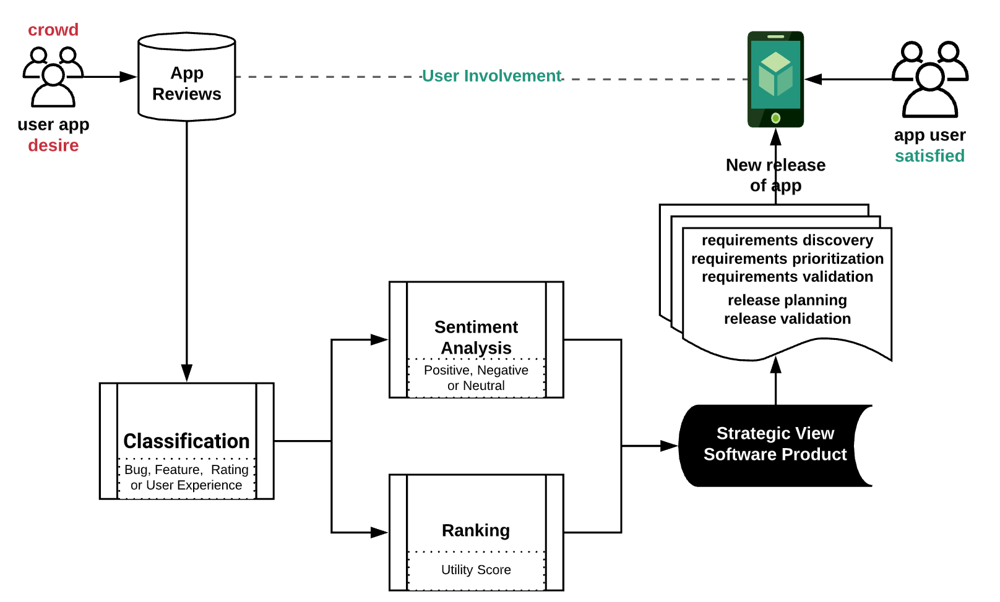

# Pipeline for app reviews analysis
A large volume of reviews, written in natural language, are registered in the app stores and have the latent desires of app users. The result generated by these steps gives support to the developer to make strategic decisions about new releases since it considers the opinion of a crowd of users. When using new releases, the user feels more involved and satisfied with the process of evolution of the app.

## Classification
Step aims to organize the reviews in classes like a bug report, new features, and user experiences. A preliminary study was presented in From Bag-of-Words to Pre-trained Neural Language Models:Improving Automatic Classification of App Reviews forRequirements Engineering

## Sentiment Analysis
Extracts the polarity (positive, negative, or neutral) of review.

## Ranking
Generates a utility score for the review, where reviews with higher scores are more likely to be relevant for users and developers.
